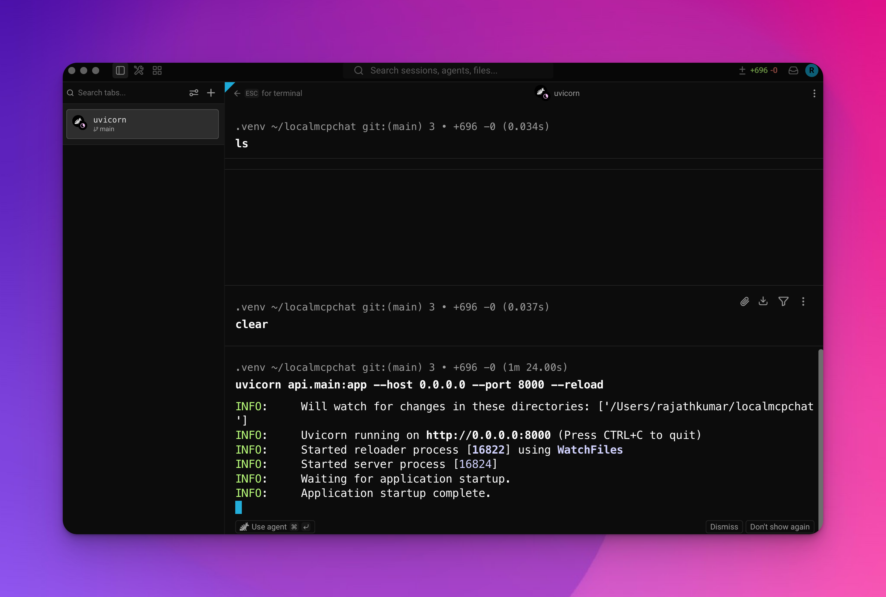
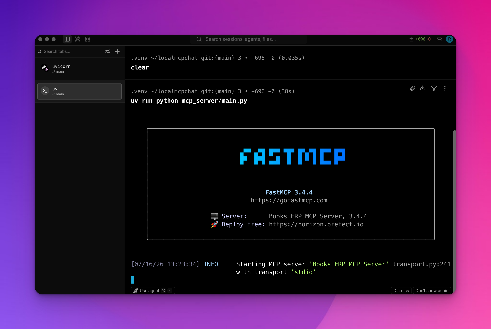
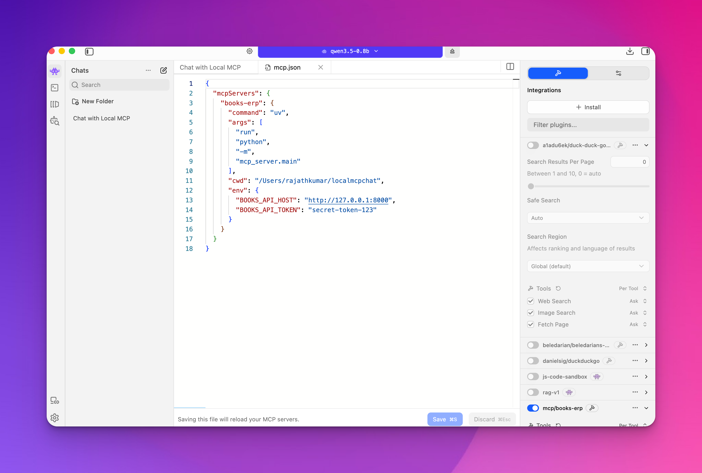
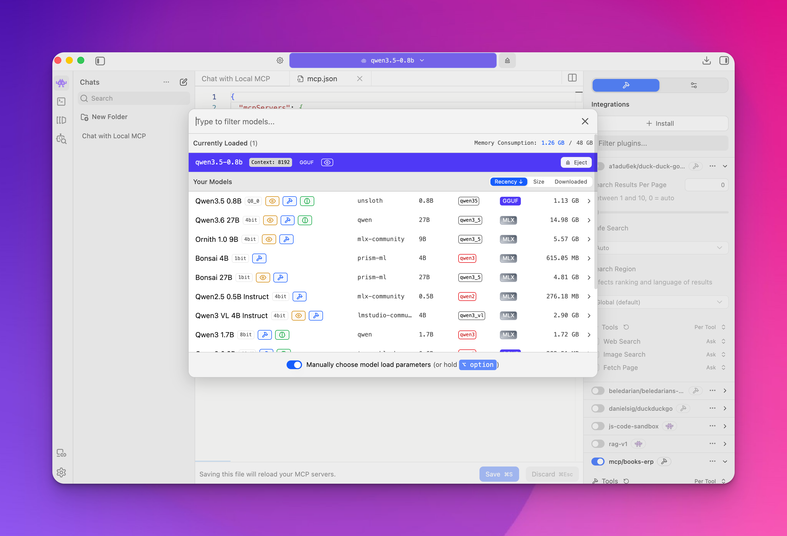
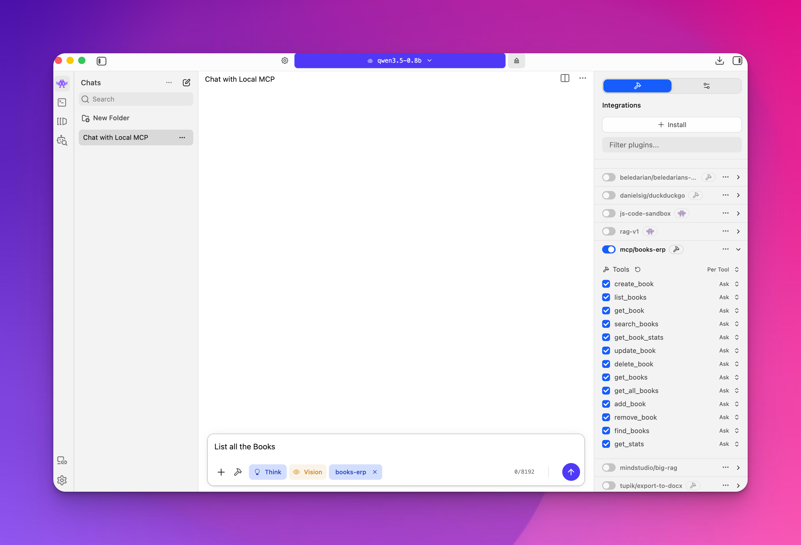
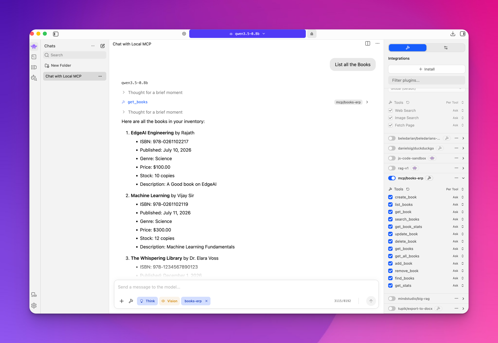

# Local MCP Chat

A local MCP (Model Context Protocol) chat application that lets you interact with AI models (Qwen, Gemma3, etc.) on your own machine via **LM Studio**, backed by a full **Books ERP** system with a REST API, SQLite storage, Bearer token auth, and an MCP server bridge.

---

## Table of Contents

- [Overview](#overview)
- [Architecture](#architecture)
- [Project Structure](#project-structure)
- [Components](#components)
  - [REST API (FastAPI)](#rest-api-fastapi)
  - [MCP Server (FastMCP)](#mcp-server-fastmcp)
  - [SQLite Database](#sqlite-database)
  - [Authentication](#authentication)
- [Data Flow Diagrams](#data-flow-diagrams)
  - [REST API Request Flow](#rest-api-request-flow)
  - [MCP Tool Call Flow](#mcp-tool-call-flow)
  - [CRUD Lifecycle Flow](#crud-lifecycle-flow)
- [Database Schema](#database-schema)
- [API Endpoints Reference](#api-endpoints-reference)
- [MCP Tools Reference](#mcp-tools-reference)
- [Environment Variables](#environment-variables)
- [Setup & Installation](#setup--installation)
- [Visual Walkthrough](#visual-walkthrough)
- [Running the System](#running-the-system)
- [Running Tests](#running-tests)
- [MCP Configuration](#mcp-configuration)
- [Tech Stack](#tech-stack)

---

## Overview

The system is composed of three layers:

1. **REST API** — A FastAPI application providing full CRUD operations for a book inventory, secured with Bearer token authentication, backed by SQLite.

2. **MCP Server** — A FastMCP server that exposes the REST API as MCP tools, allowing LLM clients like LM Studio to manage books through natural language.

3. **SQLite Database** — A persistent data store using Python's built-in `sqlite3` module. Data survives across server restarts.

```
┌─────────────────────────────────────────────────────────────────────────┐
│                          LOCAL MCP CHAT                                 │
│                                                                         │
│   ┌─────────────┐      ┌─────────────┐      ┌─────────────────────┐    │
│   │  LM Studio  │      │  MCP Server │      │     REST API        │    │
│   │  (Qwen /    │      │ (FastMCP)   │      │    (FastAPI)        │    │
│   │  Gemma3)    │      │             │      │                     │    │
│   │             │      │  7 Tools    │      │  9 Endpoints        │    │
│   │  Natural    │─────▶│             │─────▶│  Bearer Auth        │    │
│   │  Language   │ stdio│  httpx      │ HTTP │  Pydantic Validation│   │
│   │  Chat       │      │  client     │      │                     │    │
│   └─────────────┘      └─────────────┘      └────────┬────────────┘    │
│                                                      │                  │
│                                                      ▼                  │
│                                              ┌──────────────┐          │
│                                              │   SQLite     │          │
│                                              │   books.db   │          │
│                                              └──────────────┘          │
└─────────────────────────────────────────────────────────────────────────┘
```

---

## Visual Walkthrough

For the complete setup, verification, and troubleshooting procedure, read [How to Run This App](docs/How%20to%20Run%20This%20App.md).

### 1. Start the FastAPI service



### 2. FastMCP server uses stdio transport



### 3. Configure the Books ERP MCP server in LM Studio



### 4. Select a tool-calling local model



### 5. Enable the Books ERP tools in a chat



### 6. Ask for books and receive a grounded result



---

## Architecture

### High-Level System Architecture

```
                         ┌──────────────────────────┐
                         │       User / LLM          │
                         │   "Add a book called      │
                         │    Dune by Frank Herbert" │
                         └─────────────┬────────────┘
                                       │
                                       │ Natural language
                                       ▼
                    ┌──────────────────────────────────┐
                    │          LM Studio               │
                    │   (Local LLM Runtime)            │
                    │                                  │
                    │   Model: Qwen / Gemma3 1B        │
                    │   MCP Client (stdio transport)   │
                    └──────────────┬───────────────────┘
                                   │
                                   │ MCP Protocol (JSON-RPC over stdio)
                                   │
                                   │  {"method": "tools/call",
                                   │   "params": {"name": "create_book",
                                   │               "arguments": {...}}}
                                   ▼
                    ┌──────────────────────────────────┐
                    │       MCP Server                 │
                    │   (mcp_server/main.py)           │
                    │   (FastMCP + httpx)              │
                    │                                  │
                    │   Tools:                         │
                    │   • create_book                  │
                    │   • list_books                   │
                    │   • get_book                     │
                    │   • search_books                 │
                    │   • get_book_stats               │
                    │   • update_book                  │
                    │   • delete_book                  │
                    └──────────────┬───────────────────┘
                                   │
                                   │ HTTP REST calls
                                   │ Authorization: Bearer <token>
                                   │
                                   ▼
                    ┌──────────────────────────────────┐
                    │       REST API                   │
                    │   (api/main.py)                  │
                    │   (FastAPI + Uvicorn)            │
                    │                                  │
                    │   Middleware:                    │
                    │   • Bearer token auth            │
                    │   • Pydantic validation          │
                    │   • Auto docs (/docs)            │
                    └──────────────┬───────────────────┘
                                   │
                                   │ sqlite3 queries
                                   ▼
                    ┌──────────────────────────────────┐
                    │       SQLite Database            │
                    │   (books.db)                     │
                    │                                  │
                    │   Table: books                   │
                    │   • id (PK, autoincrement)       │
                    │   • title, author, isbn          │
                    │   • genre, price, stock          │
                    │   • description, dates           │
                    └──────────────────────────────────┘
```

### Component Dependency Graph

```
                    ┌─────────────┐
                    │ pyproject    │
                    │ .toml       │
                    │             │
                    │ fastapi     │
                    │ fastmcp     │
                    │ uvicorn     │
                    │ pytest (dev)│
                    │ httpx (dev) │
                    └──────┬──────┘
                           │
              ┌────────────┼────────────┐
              │            │            │
              ▼            ▼            ▼
        ┌──────────┐ ┌──────────┐ ┌──────────┐
        │ api/     │ │ mcp_server│ │ pytest   │
        │          │ │ /        │ │ .ini     │
        │ main.py  │ │ main.py  │ └──────────┘
        │ models.py│ │          │
        │ store.py │ │ imports  │
        │ auth.py  │ │ httpx    │
        └────┬─────┘ └────┬─────┘
             │            │
             │            │ HTTP calls
             │            │ to api/main.py
             │            │
             ▼            ▼
        ┌──────────────────────┐
        │    books.db          │
        │    (SQLite file)     │
        └──────────────────────┘
```

---

## Project Structure

```
localmcpchat/
│
├── README.md                         # This file — full project documentation
├── pyproject.toml                    # Project config & dependencies (uv)
├── pytest.ini                        # Pytest configuration
├── uv.lock                           # Lock file for reproducible installs
├── .gitignore                        # Ignores .venv, books.db, __pycache__
│
├── api/                              # ── REST API (FastAPI) ──
│   ├── __init__.py                   #   Package init
│   ├── main.py                       #   FastAPI app — all route handlers
│   ├── models.py                     #   Pydantic models (Book, BookCreate, etc.)
│   ├── store.py                      #   SQLite-backed BookStore class
│   ├── auth.py                       #   Bearer token authentication
│   ├── README.md                     #   API-specific documentation
│   ├── API_TESTING.md                #   Manual testing guide with curl examples
│   └── tests/                        #   Pytest test suite (64 tests)
│       ├── __init__.py
│       ├── conftest.py               #     Shared fixtures (client, auth, data)
│       ├── test_health.py            #     Root & health endpoint tests (4)
│       ├── test_auth.py              #     Auth enforcement tests (10)
│       ├── test_create.py            #     Book creation validation tests (11)
│       ├── test_read.py              #     List/get/search/stats tests (16)
│       ├── test_update_delete.py     #     Update & delete tests (11)
│       └── test_store.py             #   Direct BookStore unit tests (9)
│
└── mcp_server/                       # ── MCP Server (FastMCP) ──
    ├── __init__.py                   #   Package init
    ├── main.py                       #   MCP server — 7 tools over stdio
    ├── mcp_config.json               #   Ready-to-use MCP config for clients
    └── README.md                     #   MCP server-specific documentation
```

---

## Components

### REST API (FastAPI)

The REST API is the core of the system. It provides 9 HTTP endpoints for managing books with full CRUD operations, search, filtering, pagination, and statistics.

**Key files:**

| File | Responsibility |
|------|---------------|
| `api/main.py` | Route handlers, request/response models, endpoint definitions |
| `api/models.py` | Pydantic models for validation (`BookBase`, `BookCreate`, `BookUpdate`, `Book`, `BookResponse`, `BookStats`, `Genre`) |
| `api/store.py` | `BookStore` class — SQLite CRUD operations with parameterized queries |
| `api/auth.py` | `verify_token` dependency — Bearer token validation |

**Features:**
- Full CRUD: Create, Read (list + get by ID), Update (partial), Delete
- Search across title, author, and description (case-insensitive)
- Filtering by genre, author, price range, in-stock status
- Pagination via `skip` and `limit` query parameters
- Aggregate statistics (total books, stock, value, breakdown by genre)
- Bearer token authentication on all `/books` endpoints
- Auto-generated interactive docs at `/docs` (Swagger UI) and `/redoc`
- Pydantic validation (ISBN length, price > 0, stock >= 0, date format, genre enum)

### MCP Server (FastMCP)

The MCP server bridges LLM clients and the REST API. It exposes 7 tools that map to the REST endpoints, communicating over stdio transport.

**Key design decisions:**
- Uses `httpx` to call the REST API over HTTP (not direct `BookStore` import)
- Reads `BOOKS_API_HOST` and `BOOKS_API_TOKEN` from environment for configuration
- Returns JSON responses directly to the LLM for structured consumption
- Handles 404 errors gracefully, returning friendly messages instead of exceptions

### SQLite Database

The system uses Python's built-in `sqlite3` module — no external database server required.

**Advantages:**
- Zero configuration — no separate database process to run
- Data persists across server restarts via `books.db` file
- ACID-compliant transactions
- Parameterized queries prevent SQL injection
- `check_same_thread=False` allows FastAPI's async/threaded handlers to share the connection

### Authentication

All `/books` endpoints require a Bearer token in the `Authorization` header:

```
Authorization: Bearer secret-token-123
```

The token is set via the `BOOKS_API_TOKEN` environment variable (default: `secret-token-123`).

The `/` (root) and `/health` endpoints are public — no auth required.

```
                    ┌──────────────┐
                    │  HTTP Request │
                    │  to /books    │
                    └──────┬───────┘
                           │
                           ▼
                    ┌──────────────┐     ┌──────────────┐
                    │  Has Auth    │ NO  │  401         │
                    │  Header?     │────▶│  Unauthorized│
                    └──────┬───────┘     └──────────────┘
                           │ YES
                           ▼
                    ┌──────────────┐     ┌──────────────┐
                    │  Scheme =    │ NO  │  401         │
                    │  "Bearer"?   │────▶│  Invalid     │
                    │              │     │  scheme      │
                    └──────┬───────┘     └──────────────┘
                           │ YES
                           ▼
                    ┌──────────────┐     ┌──────────────┐
                    │  Token       │ NO  │  403         │
                    │  matches?    │────▶│  Forbidden   │
                    └──────┬───────┘     └──────────────┘
                           │ YES
                           ▼
                    ┌──────────────┐
                    │  Request     │
                    │  processed   │
                    └──────────────┘
```

---

## Data Flow Diagrams

### REST API Request Flow

```
  Client (curl / Postman / MCP Server)
    │
    │  POST /books
    │  Headers: { Authorization: Bearer <token>, Content-Type: application/json }
    │  Body: { "title": "Dune", "author": "Frank Herbert", ... }
    │
    ▼
  ┌─────────────────────────────────────────────────────────┐
  │  FastAPI (api/main.py)                                  │
  │                                                         │
  │  1. Route matching     → POST /books                    │
  │  2. Auth dependency    → verify_token()                 │
  │     • Extract Bearer token from header                  │
  │     • Compare against BOOKS_API_TOKEN env var           │
    │     • Reject if missing/wrong (401/403)                │
  │  3. Request body       → Pydantic BookCreate validation │
  │     • Validate title (1-300 chars)                      │
  │     • Validate ISBN (10-17 chars)                       │
  │     • Validate price (> 0)                              │
  │     • Validate date format (YYYY-MM-DD)                 │
  │     • Validate genre (enum)                             │
  │     • Reject if invalid (422)                           │
  │  4. Call store.create(book_data)                        │
  └────────────────────────┬────────────────────────────────┘
                           │
                           ▼
  ┌─────────────────────────────────────────────────────────┐
  │  BookStore (api/store.py)                               │
  │                                                         │
  │  5. Build SQL INSERT with parameterized values          │
  │  6. Execute: INSERT INTO books (...) VALUES (?, ...)    │
  │  7. Commit transaction                                  │
  │  8. Fetch the new row by lastrowid                      │
  │  9. Return Book object                                  │
  └────────────────────────┬────────────────────────────────┘
                           │
                           ▼
  ┌─────────────────────────────────────────────────────────┐
  │  SQLite (books.db)                                      │
  │                                                         │
  │  10. Write row to disk                                  │
  │  11. Auto-increment id assigned                         │
  └─────────────────────────────────────────────────────────┘
                           │
                           ▼
  ┌─────────────────────────────────────────────────────────┐
  │  Response                                               │
  │                                                         │
  │  HTTP 201 Created                                       │
  │  {                                                      │
  │    "id": 1,                                             │
  │    "title": "Dune",                                     │
  │    "author": "Frank Herbert",                           │
  │    "isbn": "9780441172719",                             │
  │    "published_date": "1965-08-01",                      │
  │    "genre": "science",                                  │
  │    "price": 9.99,                                       │
  │    "stock_quantity": 25,                                │
  │    "description": null,                                 │
  │    "created_at": "2026-07-11T18:40:00Z",                │
  │    "updated_at": "2026-07-11T18:40:00Z"                 │
  │  }                                                      │
  └─────────────────────────────────────────────────────────┘
```

### MCP Tool Call Flow

```
  User types: "Add a book called Dune by Frank Herbert"
    │
    ▼
  ┌─────────────────────────────────────────────────────────┐
  │  LM Studio (LLM Client)                                 │
  │                                                         │
  │  1. LLM processes the natural language request          │
  │  2. LLM decides to call MCP tool: create_book           │
  │  3. LLM extracts arguments from the user's message      │
  │  4. Sends JSON-RPC over stdio:                          │
  │     {                                                   │
  │       "method": "tools/call",                           │
  │       "params": {                                       │
  │         "name": "create_book",                          │
  │         "arguments": {                                  │
  │           "title": "Dune",                              │
  │           "author": "Frank Herbert",                    │
  │           "isbn": "9780441172719",                      │
  │           "published_date": "1965-08-01",               │
  │           "price": 9.99,                                │
  │           "genre": "science",                           │
  │           "stock_quantity": 25                          │
  │         }                                               │
  │       }                                                 │
  │     }                                                   │
  └────────────────────────┬────────────────────────────────┘
                           │ stdio (JSON-RPC)
                           ▼
  ┌─────────────────────────────────────────────────────────┐
  │  MCP Server (mcp_server/main.py)                        │
  │                                                         │
  │  5. FastMCP receives tools/call request                 │
  │  6. Dispatches to create_book() function                │
  │  7. Function builds HTTP request body                   │
  │  8. Sends HTTP POST to REST API:                        │
  │     POST http://127.0.0.1:8000/books                    │
  │     Headers: Authorization: Bearer secret-token-123     │
  │     Body: { "title": "Dune", ... }                      │
  └────────────────────────┬────────────────────────────────┘
                           │ HTTP
                           ▼
  ┌─────────────────────────────────────────────────────────┐
  │  REST API (api/main.py)                                 │
  │                                                         │
  │  9.  Auth check (Bearer token)                          │
  │  10. Pydantic validation                                │
  │  11. store.create() → SQLite INSERT                     │
  │  12. Return 201 + JSON book object                      │
  └────────────────────────┬────────────────────────────────┘
                           │ HTTP Response
                           ▼
  ┌─────────────────────────────────────────────────────────┐
  │  MCP Server (mcp_server/main.py)                        │
  │                                                         │
  │  13. Receives HTTP response                             │
  │  14. Returns JSON to LLM via stdio                      │
  └────────────────────────┬────────────────────────────────┘
                           │ stdio (JSON-RPC)
                           ▼
  ┌─────────────────────────────────────────────────────────┐
  │  LM Studio (LLM Client)                                 │
  │                                                         │
  │  15. LLM receives tool result                           │
  │  16. LLM generates natural language response:           │
  │      "I've added 'Dune' by Frank Herbert to the         │
  │       inventory. The book has been assigned ID 1."      │
  └─────────────────────────────────────────────────────────┘
```

### CRUD Lifecycle Flow

```
    CREATE          READ            UPDATE           DELETE
    ───────         ────            ──────           ──────

    POST /books     GET /books      PUT /books/{id}  DELETE /books/{id}
        │               │               │               │
        ▼               ▼               ▼               ▼
   ┌────────┐     ┌────────┐     ┌────────┐     ┌────────┐
   │Validate│     │  Auth  │     │  Auth  │     │  Auth  │
   │  body  │     │ Check  │     │ Check  │     │ Check  │
   └───┬────┘     └───┬────┘     └───┬────┘     └───┬────┘
       │              │              │              │
       ▼              ▼              ▼              ▼
   ┌────────┐     ┌────────┐     ┌────────┐     ┌────────┐
   │ INSERT │     │ SELECT │     │ UPDATE │     │ DELETE │
   │ INTO   │     │ * FROM │     │  SET   │     │  FROM  │
   │ books  │     │ books  │     │ books  │     │ books  │
   └───┬────┘     └───┬────┘     └───┬────┘     └───┬────┘
       │              │              │              │
       ▼              ▼              ▼              ▼
   ┌────────┐     ┌────────┐     ┌────────┐     ┌────────┐
   │  201   │     │  200   │     │  200   │     │  204   │
   │ Created│     │  OK    │     │  OK    │     │ No     │
   │ + JSON │     │ + JSON │     │ + JSON │     │ Content│
   └────────┘     └────────┘     └────────┘     └────────┘

         ┌──────────────────────────────────┐
         │         SQLite books.db          │
         │                                  │
         │  ┌────┬───────┬────────┬───────┐ │
         │  │ id │ title │ author │ price │ │
         │  ├────┼───────┼────────┼───────┤ │
         │  │  1 │ Dune  │ Herbert│  9.99 │ │
         │  │  2 │ 1984  │ Orwell │ 12.50 │ │
         │  │  3 │ Hobbit│ Tolkien│ 15.99 │ │
         │  └────┴───────┴────────┴───────┘ │
         └──────────────────────────────────┘
```

---

## Database Schema

```
┌─────────────────────────────────────────────────────────────┐
│                      books table                            │
├─────────────────┬──────────────┬────────────────────────────┤
│ Column          │ Type         │ Constraints                │
├─────────────────┼──────────────┼────────────────────────────┤
│ id              │ INTEGER      │ PRIMARY KEY AUTOINCREMENT  │
│ title           │ TEXT         │ NOT NULL                   │
│ author          │ TEXT         │ NOT NULL                   │
│ isbn            │ TEXT         │ NOT NULL                   │
│ published_date  │ TEXT         │ NOT NULL  (YYYY-MM-DD)     │
│ genre           │ TEXT         │ NOT NULL  DEFAULT 'other'  │
│ price           │ REAL         │ NOT NULL  (> 0)            │
│ stock_quantity  │ INTEGER      │ NOT NULL  DEFAULT 0 (>= 0) │
│ description     │ TEXT         │ NULLABLE  (max 2000 chars) │
│ created_at      │ TEXT         │ NOT NULL  (ISO 8601)       │
│ updated_at      │ TEXT         │ NOT NULL  (ISO 8601)       │
└─────────────────┴──────────────┴────────────────────────────┘
```

**Available genres:**

```
fiction · non_fiction · science · history · biography · fantasy
mystery · romance · thriller · children · other
```

---

## API Endpoints Reference

| Method | Path | Auth | Status | Description |
|--------|------|------|--------|-------------|
| `GET` | `/` | No | 200 | Service info (name, version, docs URL) |
| `GET` | `/health` | No | 200 | Health check (`{"status": "healthy"}`) |
| `POST` | `/books` | Yes | 201 | Create a new book |
| `GET` | `/books` | Yes | 200 | List books (with filters & pagination) |
| `GET` | `/books/search?q=` | Yes | 200 | Search by title/author/description |
| `GET` | `/books/stats` | Yes | 200 | Aggregate inventory statistics |
| `GET` | `/books/{id}` | Yes | 200 | Get a single book by ID |
| `PUT` | `/books/{id}` | Yes | 200 | Update a book (partial update) |
| `DELETE` | `/books/{id}` | Yes | 204 | Delete a book |

**Query parameters for `GET /books`:**

| Parameter | Type | Default | Description |
|-----------|------|---------|-------------|
| `skip` | int | 0 | Records to skip (pagination offset) |
| `limit` | int | 20 | Max records (1-100) |
| `genre` | enum | — | Filter by genre |
| `author` | string | — | Partial, case-insensitive author match |
| `min_price` | float | — | Minimum price (inclusive) |
| `max_price` | float | — | Maximum price (inclusive) |
| `in_stock` | bool | false | Only books with stock > 0 |

**Error responses:**

| Status | When |
|--------|------|
| `401 Unauthorized` | Missing `Authorization` header or invalid scheme |
| `403 Forbidden` | Token is incorrect |
| `404 Not Found` | Book ID doesn't exist |
| `422 Unprocessable Entity` | Validation error (bad field value) |

---

## MCP Tools Reference

| Tool | Parameters | Returns |
|------|-----------|---------|
| `create_book` | `title`, `author`, `isbn`, `published_date`, `price`, `genre?`, `stock_quantity?`, `description?` | Created book object |
| `list_books` | `skip?`, `limit?`, `genre?`, `author?`, `min_price?`, `max_price?`, `in_stock?` | Array of book objects |
| `get_book` | `book_id` | Book object or error message |
| `search_books` | `query` | Array of matching book objects |
| `get_book_stats` | _(none)_ | `{total_books, total_stock, total_value, by_genre}` |
| `update_book` | `book_id`, + any optional fields to change | Updated book object or error message |
| `delete_book` | `book_id` | Success or error message |

---

## Environment Variables

| Variable | Default | Used By | Description |
|----------|---------|---------|-------------|
| `BOOKS_API_TOKEN` | `secret-token-123` | REST API, MCP Server | Bearer token for authentication |
| `BOOKS_API_HOST` | `http://127.0.0.1:8000` | MCP Server | Base URL of the REST API |
| `BOOKS_DB_PATH` | `books.db` | REST API | Path to the SQLite database file |

---

## Setup & Installation

### Prerequisites

- **Python 3.13+**
- **[uv](https://docs.astral.sh/uv/)** package manager
- **[LM Studio](https://lmstudio.ai/)** (for LLM client — optional, for MCP usage)

### Install

```bash
# Clone or navigate to the project directory
cd localmcpchat

# Install all dependencies (FastAPI, FastMCP, Uvicorn, pytest, httpx)
uv sync
```

---

## Running the System

You need **two processes** running: the REST API and (optionally) the MCP server. The MCP server connects to the REST API over HTTP.

### Step 1: Start the REST API

```bash
# Set the Bearer token (optional — defaults to "secret-token-123")
export BOOKS_API_TOKEN="secret-token-123"

# Start the FastAPI server with hot reload
uv run uvicorn api.main:app --host 127.0.0.1 --port 8000 --reload
```

The API is now available at:
- **API base:** `http://127.0.0.1:8000`
- **Swagger UI:** `http://127.0.0.1:8000/docs`
- **ReDoc:** `http://127.0.0.1:8000/redoc`

### Step 2: Start the MCP Server (for LM Studio)

The MCP server is typically launched automatically by the LLM client using the MCP config. See [MCP Configuration](#mcp-configuration) below.

To test it manually:

```bash
export BOOKS_API_HOST="http://127.0.0.1:8000"
export BOOKS_API_TOKEN="secret-token-123"
uv run python -m mcp_server.main
```

### Quick Start (Both in One Terminal)

```bash
# Terminal 1 — REST API
export BOOKS_API_TOKEN="secret-token-123"
uv run uvicorn api.main:app --host 127.0.0.1 --port 8000 --reload &

# Wait for API to start
sleep 2

# Terminal 2 — Quick API test
curl -s http://127.0.0.1:8000/health
# → {"status":"healthy"}

# Create a book
curl -s -X POST http://127.0.0.1:8000/books \
  -H "Content-Type: application/json" \
  -H "Authorization: Bearer secret-token-123" \
  -d '{"title":"Dune","author":"Frank Herbert","isbn":"9780441172719","published_date":"1965-08-01","genre":"science","price":9.99,"stock_quantity":25}'
```

---

## Running Tests

The project includes **64 pytest tests** covering all endpoints, auth, validation, and store logic.

```bash
# Run all tests
uv run pytest -v

# Run a specific test file
uv run pytest api/tests/test_auth.py -v

# Run with short tracebacks
uv run pytest --tb=short

# Run only store unit tests
uv run pytest api/tests/test_store.py -v
```

**Test breakdown:**

| File | Tests | Coverage |
|------|-------|----------|
| `test_health.py` | 4 | Root & health endpoints, no-auth verification |
| `test_auth.py` | 10 | Missing token, wrong token, invalid scheme on all endpoints |
| `test_create.py` | 11 | Required fields, validation (price, stock, date, genre), defaults |
| `test_read.py` | 16 | List, pagination, all filters, get by ID, search, stats |
| `test_update_delete.py` | 11 | Partial update, multi-field update, delete, not-found cases |
| `test_store.py` | 9 | Direct BookStore unit tests (create, get, search, update, delete, stats) |
| **Total** | **64** | |

Tests use an in-memory SQLite database (`:memory:`) and reset between each test for isolation.

---

## MCP Configuration

### For LM Studio

Add this to LM Studio's MCP server settings:

```json
{
  "mcpServers": {
    "books-erp": {
      "command": "uv",
      "args": ["run", "python", "-m", "mcp_server.main"],
      "cwd": "/Users/rajathkumar/localmcpchat",
      "env": {
        "BOOKS_API_HOST": "http://127.0.0.1:8000",
        "BOOKS_API_TOKEN": "secret-token-123"
      }
    }
  }
}
```

### For Claude Desktop

Add to `~/Library/Application Support/Claude/claude_desktop_config.json`:

```json
{
  "mcpServers": {
    "books-erp": {
      "command": "uv",
      "args": ["run", "--directory", "/Users/rajathkumar/localmcpchat", "python", "-m", "mcp_server.main"],
      "env": {
        "BOOKS_API_HOST": "http://127.0.0.1:8000",
        "BOOKS_API_TOKEN": "secret-token-123"
      }
    }
  }
}
```

### For Cursor / Windsurf

Add to `.cursor/mcp.json` or `.windsurf/mcp.json`:

```json
{
  "mcpServers": {
    "books-erp": {
      "command": "uv",
      "args": ["run", "--directory", "/Users/rajathkumar/localmcpchat", "python", "-m", "mcp_server.main"],
      "env": {
        "BOOKS_API_HOST": "http://127.0.0.1:8000",
        "BOOKS_API_TOKEN": "secret-token-123"
      }
    }
  }
}
```

### Natural Language Examples (via MCP)

Once connected, you can ask the LLM:

- "Add a new book called Dune by Frank Herbert, ISBN 9780441172719, published 1965-08-01, genre science, price $9.99, 25 copies in stock"
- "List all fantasy books"
- "Search for books by Tolkien"
- "Update the price of book ID 3 to $19.99"
- "Delete book ID 5"
- "Give me inventory statistics"
- "Show me all books that are out of stock"
- "Find books between $10 and $20"

---

## Tech Stack

| Layer | Technology | Purpose |
|-------|-----------|---------|
| **REST API** | [FastAPI](https://fastapi.tiangolo.com/) | Web framework with auto docs & validation |
| **Validation** | [Pydantic](https://pydantic.dev/) | Data models & request/response validation |
| **Database** | [sqlite3](https://docs.python.org/3/library/sqlite3.html) | Built-in Python SQLite (no external DB) |
| **Auth** | Bearer token | Simple fixed-token authentication |
| **MCP Server** | [FastMCP](https://github.com/jlowin/fastmcp) | MCP server framework (stdio transport) |
| **HTTP Client** | [httpx](https://www.python-httpx.org/) | MCP server → REST API communication |
| **ASGI Server** | [Uvicorn](https://www.uvicorn.org/) | FastAPI runtime |
| **Testing** | [pytest](https://docs.pytest.org/) | Test framework (64 tests) |
| **Package Mgmt** | [uv](https://docs.astral.sh/uv/) | Fast Python package manager |
| **LLM Runtime** | [LM Studio](https://lmstudio.ai/) | Local LLM inference (Qwen, Gemma3) |
